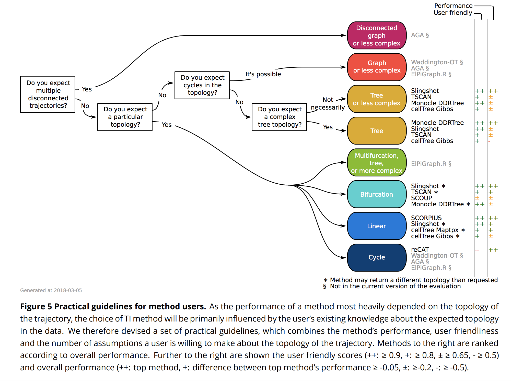

# Pseudotime Cell Trajectories
  - [Comparison: Cell Trajectories](https://www.biorxiv.org/content/10.1101/276907v1)
  - [Diffusion maps for high-dimensional single-cellanalysis](https://academic.oup.com/bioinformatics/article/31/18/2989/241305)
  - [Diffusion pseudotime](https://www.nature.com/articles/nmeth.3971)
  - [Slingshot Paper](https://www.ncbi.nlm.nih.gov/pmc/articles/PMC6007078/)
  - [Optimal Transport](https://www.cell.com/cell/fulltext/S0092-8674(19)30039-X)
  - [RNA Velocity](https://www.nature.com/articles/s41586-018-0414-6)
  


## Google Slides

<iframe src="https://docs.google.com/presentation/d/e/2PACX-1vQuzaq2kbvEEc3mrUwILcCHuovrKKZWU45EQVEzWISgRVgl3A5KYR1FuY1cS2w0DHG-0wO19zGtvaNj/embed?start=false&loop=false&delayms=3000" frameborder="0" width="760" height="569" allowfullscreen="true" mozallowfullscreen="true" webkitallowfullscreen="true"></iframe>

## Comparison Abstract

Using single-cell -omics data, it is now possible to computationally order cells along trajectories, allowing the unbiased study of cellular dynamic processes. Since 2014, more than 50 trajectory inference methods have been developed, each with its own set of methodological characteristics. As a result, choosing a method to infer trajectories is often challenging, since a comprehensive assessment of the performance and robustness of each method is still lacking. In order to facilitate the comparison of the results of these methods to each other and to a gold standard, we developed a global framework to benchmark trajectory inference tools. Using this framework, we compared the trajectories from a total of 29 trajectory inference methods, on a large collection of real and synthetic datasets. We evaluate methods using several metrics, including accuracy of the inferred ordering, correctness of the network topology, code quality and user friendliness. We found that some methods, including Slingshot [@street2018slingshot], TSCAN [@ji2016tscan] and Monocle DDRTree [@trapnell2014dynamics], clearly outperform other methods, although their performance depended on the type of trajectory present in the data. Based on our benchmarking results, we therefore developed a set of guidelines for method users. However, our analysis also indicated that there is still a lot of room for improvement, especially for methods detecting complex trajectory topologies. Our evaluation pipeline can therefore be used to spearhead the development of new scalable and more accurate methods, and is available at [github.com/dynverse/dynverse](https://github.com/dynverse/dynverse). [@saelens2018comparison]


[@haghverdi2015diffusion]
[@haghverdi2016diffusion]
[@street2018slingshot]
[@schiebinger2019optimal]
[@la2018rna]


```{r}

```
